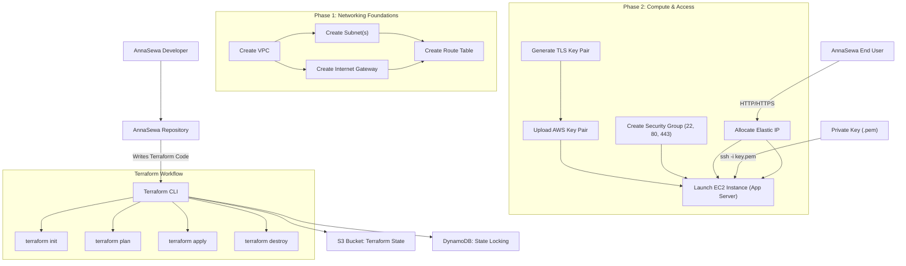

# AnnaSewa - Story
This file represents the **end-to-end story of AnnaSewa Infrastructure**, showing all components, architecture, workflows, Terraform state handling, provisioning phases, and lifecycle.

## 📂 Project Structure

```text
AnnaSewa/
├── infrastructure/           # Terraform scripts for AWS infra
│   ├── main.tf
│   ├── variables.tf
│   ├── outputs.tf
│   └── modules/
│
├── backend/                  # Python FastAPI services
│   ├── auth/                 # Authentication & authorization
│   ├── donation/             # Food donation service
│   ├── distribution/         # Matching donors & receivers
│   ├── impact/               # Analytics & reports
│   └── gateway/              # API gateway / service router
│
├── frontend/                 # React (Next.js) web app
│   ├── components/
│   ├── pages/
│   ├── services/
│   └── styles/
│
├── scripts/                  # Utility scripts (DB migrations, setup)
├── tests/                    # Unit & integration tests
├── docs/                     # Documentation & diagrams
│   ├── architecture.md
│   ├── annasewa-diagram.png
│   └── api-specs.md
│
├── .github/workflows/        # CI/CD pipelines (GitHub Actions)
├── docker-compose.yml        # Local dev environment
├── README.md                 # Project overview
└── LICENSE
```
Imagine AnnaSewa infrastructure as a multi-phase journey:
### *Phase 1* : Builds the foundation (VPC, IGW, subnets, routes).
### *Phase 2* : Brings the essentials (EC2, security groups, SSH keys, elastic IP).

# AnnaSewa Terraform Elaborated: 

