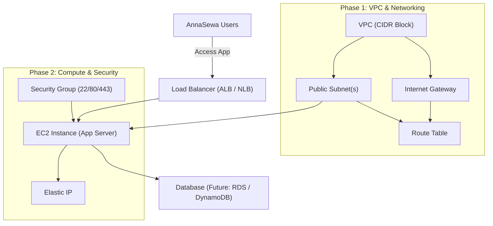
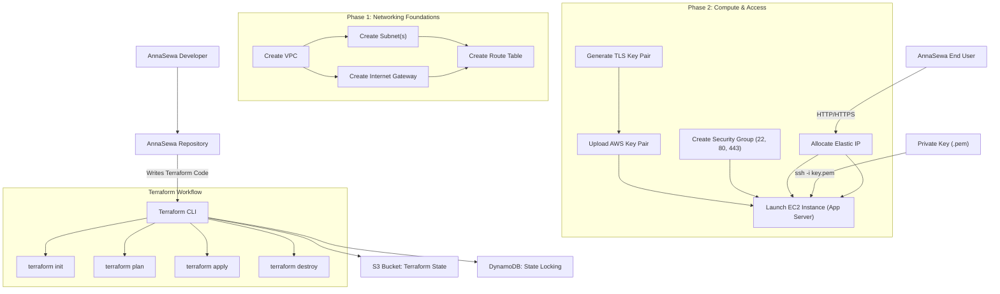

# AnnaSewa Terraform Infrastructure – Story
This file represents the **end-to-end story of AnnaSewa Infrastructure**, showing all components, workflows, Terraform state handling, provisioning phases, and lifecycle.

Imagine AnnaSewa infrastructure as a multi-phase journey:
### Phase 1 
Builds the roads and electricity (VPC, IGW, subnets, routes).
### Phase 2 
Brings the house and doors (EC2, security groups, SSH keys, elastic IP).

# AnnaSewa Terraform Elaborated: 
---

