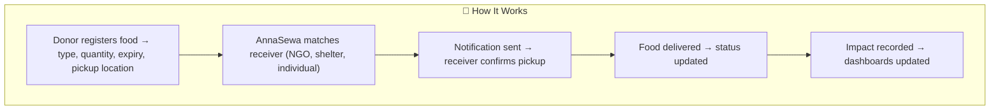
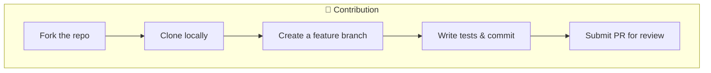

# 🍲 AnnaSewa — Food Donation Platform
[](./LICENSE)


AnnaSewa (अन्नसेवा) is a mission-driven platform that connects people and organizations with surplus food to underprivileged communities.  
It aims to **reduce food waste, fight hunger, and create stronger, more compassionate societies**.


## 📦 What's Inside?

- 📖 **[INFRA.md](INFRA.md)** – High Level Architecture, In-Depth Flow
- 📖 **[ROADMAP.md](ROADMAP.md)** – 1 Month Development Plan 
- 📖 **[APACHE 2.0 LICENSE](./LICENSE)** - Project License

## 🌍 Why AnnaSewa?
### Hunger Snapshot in India
- **India ranks 105th out of 127 countries** in the **Global Hunger Index (2024)** — classified as *“serious”*.  
- **13.7%** of the population is undernourished.  
- **35.5%** of children under 5 suffer from stunting.  
- **18.7%** of children under 5 are wasted (low weight for height).  
- **2.9%** under-five mortality rate.  

*(Source: [Global Hunger Index 2024](https://www.globalhungerindex.org/india.html))*  


### Why Food Donation Platforms?
- Prevent **food waste** from restaurants, events, and households.  
- Provide **nutritious meals** to the needy.  
- Reduce **environmental impact** (less food in landfills → lower methane emissions).  
- Build **community resilience** by empowering local food networks.  

## 💡 The AnnaSewa Idea
AnnaSewa (अन्न सेवा) means *“Food Service”*.  

The platform is designed to:
- Enable **donors** (restaurants, shops, households) to list surplus food.  
- Enable **receivers** (NGOs, shelters, individuals) to request or access donations.  
- Allow **admins** to monitor logistics, volunteers, and impact.  
- Provide **impact metrics** → meals served, waste reduced, CO₂ emissions saved.  


## 🏗️ Tech Stack

| Layer | Technologies |
|-------|--------------|
| **Frontend** | React (Next.js), TailwindCSS |
| **Backend** | Python (FastAPI), REST APIs |
| **Databases** | PostgreSQL, DynamoDB |
| **Infrastructure** | AWS (EC2, VPC, IAM, S3, RDS, EKS) |
| **IaC** | Terraform (S3 state backend, DynamoDB lock) |
| **Containers** | Docker, Kubernetes (EKS) |
| **CI/CD** | GitHub Actions |
| **Security** | JWT Auth, IAM Roles, SGs, Secrets Manager |
| **Monitoring** | CloudWatch, Prometheus, Grafana |

## 📂 Project Structure

```text
AnnaSewa/
├── infrastructure/           # Terraform configs
│   ├── main.tf
│   ├── variables.tf
│   ├── outputs.tf
│   └── modules/
│
├── backend/                  # Python FastAPI microservices
│   ├── auth/                 # Authentication & authorization
│   ├── donation/             # Food donation service
│   ├── distribution/         # Matching donors & receivers
│   ├── impact/               # Analytics & reporting
│   └── gateway/              # API gateway
│
├── frontend/                 # React (Next.js) web app
│   ├── components/
│   ├── pages/
│   ├── services/
│   └── styles/
│
├── tests/                    # Unit & integration tests
├── docs/                     # Documentation & diagrams
│   ├── INFRA.md              # Infra Deep Dive (Terraform + AWS)
│   └── architecture.png
│
├── .github/workflows/        # CI/CD pipelines
├── docker-compose.yml        # Local development
├── README.md                 # Project overview
└── LICENSE
```

## 🔑 Key Features
        - 👥 Role-based Access → Donor, Receiver, Admin
        - 📦 Food Donation Listings with expiry & pickup details
        - 🔒 Secure APIs (JWT, IAM, Secrets Manager)
        - 📊 Impact Dashboard (meals served, CO₂ saved, waste prevented)
        - 🔔 Notifications via Email/SMS
        - 🛠 Terraform-based Infra (scalable, secure, cloud-native)
        - 📱 Responsive Web UI (accessible for NGOs & donors)
        - 🤝 Volunteer Coordination (Phase 2 feature)

## 🚀 How It Works


## 🔭 Scope
        - 📱 Native mobile apps (Android/iOS)
        - 🗺️ Real-time pickup & delivery maps
        - 📷 Food image uploads (verification)
        - 🤖 AI-based donor/receiver matching
        - ♻️ Sustainability dashboards

## 🤝 Contribution

---

