# 🍲 AnnaSewa — Food Donation Platform
<p align="center">

  <!-- License -->
  <a href="https://opensource.org/licenses/Apache-2.0">
    
  </a>

  <!-- Project Status -->
  

  <!-- Contributions -->
  <a href="https://github.com/MrCh0p808/AnnaSewa?tab=readme-ov-file#-contribution">
    
  </a>

  <!-- Frontend -->
  <a href="https://react.dev/">
    
  </a>
  <a href="https://nextjs.org/docs">
    
  </a>
  <a href="https://tailwindcss.com/docs">
    
  </a>

  <!-- Backend -->
  <a href="https://www.python.org/doc/">
    
  </a>
  <a href="https://fastapi.tiangolo.com/">
    
  </a>
  <a href="#">
    
  </a>
  <a href="https://jwt.io/">
    
  </a>

  <!-- Databases -->
  <a href="https://www.postgresql.org/docs/">
    
  </a>
  <a href="https://docs.aws.amazon.com/dynamodb/">
    
  </a>

  <!-- Cloud + Infra -->
  <a href="https://aws.amazon.com/">
    
  </a>
  <a href="https://docs.aws.amazon.com/ec2/">
    
  </a>
  <a href="https://docs.aws.amazon.com/vpc/">
    
  </a>
  <a href="https://docs.aws.amazon.com/IAM/">
    
  </a>
  <a href="https://docs.aws.amazon.com/rds/">
    
  </a>
  <a href="https://docs.aws.amazon.com/eks/">
    
  </a>
  <a href="https://developer.hashicorp.com/terraform/docs">
    
  </a>
  <a href="https://docs.docker.com/">
    
  </a>
  <a href="https://kubernetes.io/docs/">
    
  </a>
  <a href="https://docs.github.com/en/actions">
    
  </a>

  <!-- Security + Secrets -->
  <a href="https://docs.aws.amazon.com/secretsmanager/">
    
  </a>

  <!-- Monitoring -->
  <a href="https://docs.aws.amazon.com/cloudwatch/">
    
  </a>
  <a href="https://prometheus.io/docs/introduction/overview/">
    
  </a>
  <a href="https://grafana.com/docs/">
    
  </a>

</p>


AnnaSewa (अन्नसेवा) is a mission-driven platform that connects people and organizations with surplus food to underprivileged communities.  
It aims to **reduce food waste, fight hunger, and create stronger, more compassionate societies**.


## 📦 What's Inside?

- 📖 **[INFRA.md](/docs/INFRA.md)** – High Level Architecture, In-Depth Flow
- 📖 **[ROADMAP.md](/docs/ROADMAP.md)** – 1 Month Development Plan 
- 📖 **[APACHE 2.0 LICENSE](./LICENSE)** - Project License

## 🌍 Why AnnaSewa?
### Hunger Snapshot in India
- **India ranks 105th out of 127 countries** in the **Global Hunger Index (2024)** — classified as *“serious”*.  
- **13.7%** of the population is undernourished.  
- **35.5%** of children under 5 suffer from stunting.  
- **18.7%** of children under 5 are wasted (low weight for height).  
- **2.9%** under-five mortality rate.  

*(Source: [Global Hunger Index 2024](https://www.globalhungerindex.org/india.html))*  


### Why Food Donation Platforms?
- Prevent **food waste** from restaurants, events, and households.  
- Provide **nutritious meals** to the needy.  
- Reduce **environmental impact** (less food in landfills → lower methane emissions).  
- Build **community resilience** by empowering local food networks.  

## 💡 The AnnaSewa Idea
AnnaSewa (अन्न सेवा) means *“Food Service”*.  

The platform is designed to:
- Enable **donors** (restaurants, shops, households) to list surplus food.  
- Enable **receivers** (NGOs, shelters, individuals) to request or access donations.  
- Allow **admins** to monitor logistics, volunteers, and impact.  
- Provide **impact metrics** → meals served, waste reduced, CO₂ emissions saved.  


## 🏗️ Tech Stack

| Layer | Technologies |
|-------|--------------|
| **Frontend** | React (Next.js), TailwindCSS |
| **Backend** | Python (FastAPI), REST APIs |
| **Databases** | PostgreSQL, DynamoDB |
| **Infrastructure** | AWS (EC2, VPC, IAM, S3, RDS, EKS) |
| **IaC** | Terraform (S3 state backend, DynamoDB lock) |
| **Containers** | Docker, Kubernetes (EKS) |
| **CI/CD** | GitHub Actions |
| **Security** | JWT Auth, IAM Roles, SGs, Secrets Manager |
| **Monitoring** | CloudWatch, Prometheus, Grafana |

## 📂 Project Structure

```text
AnnaSewa/
├── infra/                         # Infrastructure as Code (Terraform on AWS)
│   ├── backend.tf                 # Remote backend (S3 + DynamoDB) for storing Terraform state
│   ├── provider.tf                # Terraform + AWS provider version & authentication setup
│   ├── network.tf                 # VPC, subnets, route tables, internet/NAT gateways, security groups
│   ├── compute.tf                 # EC2 instances, Auto Scaling Groups, and SSH key pair
│   ├── database.tf                # RDS (Postgres/MySQL) + Secrets Manager for credentials
│   ├── repo.tf                    # ECR repositories for container images
│   ├── variables.tf               # Input variables for reusability across modules
│   ├── locals.tf                  # Centralized naming, tagging, and common expressions
│   ├── outputs.tf                 # Exported values (IPs, DNS, DB endpoints) for integration
│   └── monitoring.tf (future)     # CloudWatch logs, alarms, dashboards (to be added later)
│
├── backend/                       # Backend (Python FastAPI microservices)
│   ├── common/                    # Shared utilities (logging, database connection, config, models)
│   ├── auth/                      # Authentication & authorization service
│   ├── donation/                  # Food donation management (CRUD APIs)
│   ├── distribution/              # Matching donors with receivers intelligently
│   ├── impact/                    # Analytics, reporting, impact measurement
│   └── gateway/                   # API gateway routing requests to microservices
│
├── frontend/                      # Frontend (React / Next.js web application)
│   ├── components/                # Reusable UI components (buttons, forms, cards, etc.)
│   ├── pages/                     # Next.js pages (routes)
│   ├── services/                  # API call wrappers to backend services
│   ├── styles/                    # Global styles, Tailwind config, and theme files
│   └── public/ (optional)         # Static assets (logos, icons, images)
│
├── tests/                         # Global unit + integration tests
│   ├── backend_tests/             # Tests for backend services (pytest)
│   ├── frontend_tests/            # Tests for frontend (Jest / React Testing Library)
│   └── infra_tests/               # Infra testing (Terratest / AWS InSpec)
│
├── docs/                          # Documentation, diagrams & plans
│   ├── INFRA.md                   # Deep dive into Terraform + AWS infra
│   ├── ROADMAP.md                 # Development milestones & release plan
│   └── ARCHITECTURE.png           # System architecture diagram
│
├── .github/workflows/             # GitHub Actions pipelines
│   ├── ci.yml                     # Build + Test (lint, unit tests, security checks)
│   └── cd.yml                     # Deploy (Terraform apply + service deploy)
│
├── docker-compose.yml              # Local development stack (DB, services, frontend)
├── .env.example                    # Example environment variables (copy to `.env`)
├── Makefile                        # Shortcut commands (init, deploy, test, clean)
├── README.md                       # High-level overview of the project
└── LICENSE                         # Apache 2.0 License (Open Source)
```

## 🔑 Key Features
        - 👥 Role-based Access → Donor, Receiver, Admin
        - 📦 Food Donation Listings with expiry & pickup details
        - 🔒 Secure APIs (JWT, IAM, Secrets Manager)
        - 📊 Impact Dashboard (meals served, CO₂ saved, waste prevented)
        - 🔔 Notifications via Email/SMS
        - 🛠 Terraform-based Infra (scalable, secure, cloud-native)
        - 📱 Responsive Web UI (accessible for NGOs & donors)
        - 🤝 Volunteer Coordination (Phase 2 feature)

## 🚀 How It Works

```mermaid
flowchart TD
    %% Workflow Section
    subgraph Workflow [🚀 How It Works]
        H1["Donor registers food → type, quantity, expiry, pickup location"] -->
        H2["AnnaSewa matches receiver (NGO, shelter, individual)"] -->
        H3["Notification sent → receiver confirms pickup"] -->
        H4["Food delivered → status updated"] -->
        H5["Impact recorded → dashboards updated"]
    end
```


## 🔭 Scope
        - 📱 Native mobile apps (Android/iOS)
        - 🗺️ Real-time pickup & delivery maps
        - 📷 Food image uploads (verification)
        - 🤖 AI-based donor/receiver matching
        - ♻️ Sustainability dashboards

## 🤝 Contribution

```mermaid
flowchart TD
    %% Contribution Section
    subgraph Contribute [🤝 Contribution]
        C1["Fork the repo"] -->
        C2["Clone locally"] -->
        C3["Create a feature branch"] -->
        C4["Write tests & commit"] -->
        C5["Submit PR for review"]
    end
```

---

