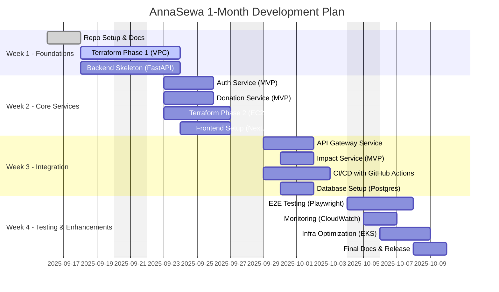

# 📅 AnnaSewa — 1 Month Development Plan

This plan breaks down **AnnaSewa Development (MVP)** into **phases** over 4 weeks.  
Each phase has GitHub **Issues & Sub-Issues**, with tasks covering **Application Code (Backend + Frontend)** and **Infrastructure (Terraform + AWS)**.

---

## 🏗️ High-Level Roadmap

## 📂 GitHub Issues Breakdown

# AnnaSewa — Month 1 Development Roadmap

This issue tracks all planned work for the first month of AnnaSewa’s development.  

---

## Phase 0 — Repo & Documentation
- [x] #1 Initialize GitHub Repo (`.gitignore`, `README.md`, `LICENSE`)
  - [ ] #1.1 Create `.gitignore` for Python, Node, Terraform
  - [x] #1.2 Add basic `README.md` template
  - [x] #1.3 Add `LICENSE` file (MIT)
- [x] #2 Setup Documentation (`README.md`, `INFRA.md`, `ROADMAP.md`)
  - [x] #2.1 Populate INFRA.md with architecture & Terraform workflow
  - [x] #2.2 Add project roadmap and phases in ROADMAP.md
  - [x] #2.3 Review README.md with project overview and dev setup

## Phase 1 — Infrastructure Foundations
- [ ] #3 Terraform Init (S3 backend, DynamoDB lock)
  - [ ] #3.1 Configure AWS provider and region
  - [ ] #3.2 Setup S3 bucket for Terraform state
  - [ ] #3.3 Configure DynamoDB table for state locking
  - [ ] #3.4 Initialize Terraform and test backend connection
- [ ] #4 VPC & Networking (VPC, Subnets, IGW, RTs)
  - [ ] #4.1 Create VPC with appropriate CIDR
  - [ ] #4.2 Create public and private subnets
  - [ ] #4.3 Attach Internet Gateway
  - [ ] #4.4 Create route tables and associate subnets
  - [ ] #4.5 Setup NAT Gateway for private subnet access
- [ ] #5 Security Baseline (IAM Roles, Security Groups)
  - [ ] #5.1 Define IAM roles for EC2, Lambda, RDS access
  - [ ] #5.2 Create Security Groups (SSH, HTTP, HTTPS)
  - [ ] #5.3 Add inbound/outbound rules for essential traffic
  - [ ] #5.4 Test connectivity via EC2 instance

## Phase 2 — Core Backend Services
- [ ] #6 Auth Service (JWT, Donor/Receiver/Admin roles)
  - [ ] #6.1 Setup FastAPI auth module
  - [ ] #6.2 Implement JWT authentication & refresh tokens
  - [ ] #6.3 Create user roles & permissions
  - [ ] #6.4 Unit test auth endpoints
- [ ] #7 Donation Service (CRUD donations, expiry, pickup details)
  - [ ] #7.1 Define donation model (DB schema)
  - [ ] #7.2 Implement CRUD endpoints
  - [ ] #7.3 Handle donation expiry logic
  - [ ] #7.4 Include pickup scheduling
- [ ] #8 Impact Service MVP (meals served, CO₂ saved)
  - [ ] #8.1 Create impact metrics schema
  - [ ] #8.2 Implement data aggregation endpoints
  - [ ] #8.3 Connect with donation service for live stats
- [ ] #9 API Gateway (routing, CORS)
  - [ ] #9.1 Setup FastAPI gateway module
  - [ ] #9.2 Configure routes for all services
  - [ ] #9.3 Add CORS middleware

## Phase 3 — Frontend (MVP Web App)
- [ ] #10 Setup Next.js + Tailwind
  - [ ] #10.1 Initialize Next.js project
  - [ ] #10.2 Install TailwindCSS and configure
  - [ ] #10.3 Setup basic page layout and routing
- [ ] #11 Donor Dashboard (Add Donation)
  - [ ] #11.1 Create form to add new donations
  - [ ] #11.2 Display donor’s active donations
  - [ ] #11.3 Connect to backend API
- [ ] #12 Receiver Dashboard (Claim Food)
  - [ ] #12.1 List available donations
  - [ ] #12.2 Add claim/accept functionality
  - [ ] #12.3 Confirm pickup scheduling
- [ ] #13 Admin Dashboard (Monitoring)
  - [ ] #13.1 Display key metrics (donations, claims)
  - [ ] #13.2 Show user activity logs
  - [ ] #13.3 Implement basic impact dashboard

## Phase 4 — CI/CD & Deployment
- [ ] #14 GitHub Actions CI (Lint, Tests, Build)
  - [ ] #14.1 Configure Python and Node.js workflows
  - [ ] #14.2 Add linting and unit test steps
  - [ ] #14.3 Setup build artifacts for deployment
- [ ] #15 Dockerize Backend & Frontend
  - [ ] #15.1 Create Dockerfile for FastAPI backend
  - [ ] #15.2 Create Dockerfile for Next.js frontend
  - [ ] #15.3 Setup docker-compose for local dev
- [ ] #16 Terraform Deploy to AWS (EC2, EIP, SG)
  - [ ] #16.1 Apply Terraform scripts for Phase 1 & 2
  - [ ] #16.2 Verify EC2 instances, EIP, and SGs
  - [ ] #16.3 Test backend services on deployed EC2
- [ ] #17 Setup Monitoring (CloudWatch basic alarms)
  - [ ] #17.1 Create CloudWatch log groups for backend
  - [ ] #17.2 Setup CPU/Memory alarms for EC2
  - [ ] #17.3 Configure notifications (SNS/email)

---

## ✅ Deliverables by End of Month
- [ ] Running **AnnaSewa MVP** on AWS EC2
- [ ] Donor/Receiver flows tested end-to-end
- [ ] Terraform IaC in place
- [ ] CI/CD automated with GitHub Actions
- [ ] Impact dashboard (basic metrics)

