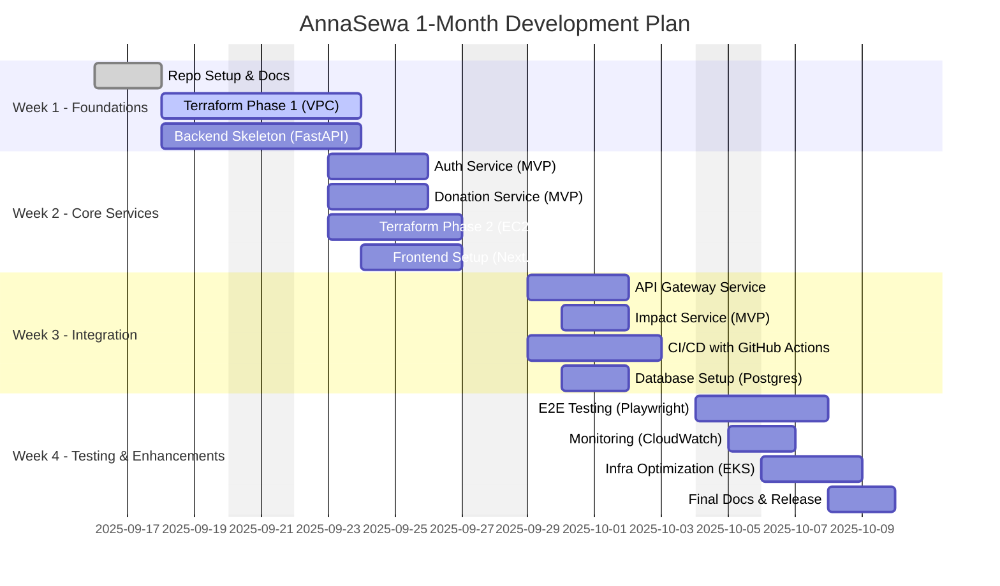

# 📅 AnnaSewa — 1 Month Development Plan

This plan breaks down **AnnaSewa Development (MVP)** into **phases** over 4 weeks.  
Each phase has GitHub **Issues & Sub-Issues**, with tasks covering **Application Code (Backend + Frontend)** and **Infrastructure (Terraform + AWS)**.

---

## 🏗️ High-Level Roadmap

## 📂 GitHub Issues Breakdown

# AnnaSewa — Month 1 Development Roadmap

This issue tracks all planned work for the first month of AnnaSewa’s development.  

---

## Phase 0 — Repo & Documentation
- [ ] #1 Initialize GitHub Repo (`.gitignore`, `README.md`, `LICENSE`)
- [ ] #2 Setup Documentation (`PLAN.md`, `INFRA.md`, `ARCHITECTURE.md`)

## Phase 1 — Infrastructure Foundations
- [ ] #3 Terraform Init (S3 backend, DynamoDB lock)
- [ ] #4 VPC & Networking (VPC, Subnets, IGW, RTs)
- [ ] #5 Security Baseline (IAM Roles, Security Groups)

## Phase 2 — Core Backend Services
- [ ] #6 Auth Service (JWT, Donor/Receiver/Admin roles)
- [ ] #7 Donation Service (CRUD donations, expiry, pickup details)
- [ ] #8 Impact Service MVP (meals served, CO₂ saved)
- [ ] #9 API Gateway (routing, CORS)

## Phase 3 — Frontend (MVP Web App)
- [ ] #10 Setup Next.js + Tailwind
- [ ] #11 Donor Dashboard (Add Donation)
- [ ] #12 Receiver Dashboard (Claim Food)
- [ ] #13 Admin Dashboard (Monitoring)

## Phase 4 — CI/CD & Deployment
- [ ] #14 GitHub Actions CI (Lint, Tests, Build)
- [ ] #15 Dockerize Backend & Frontend
- [ ] #16 Terraform Deploy to AWS (EC2, EIP, SG)
- [ ] #17 Setup Monitoring (CloudWatch basic alarms)

---

## ✅ Deliverables by End of Month
- [ ] Running **AnnaSewa MVP** on AWS EC2
- [ ] Donor/Receiver flows tested end-to-end
- [ ] Terraform IaC in place
- [ ] CI/CD automated with GitHub Actions
- [ ] Impact dashboard (basic metrics)
