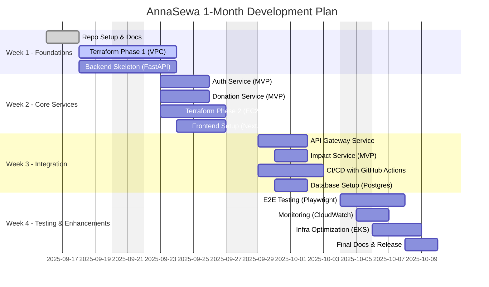

# 📅 AnnaSewa — 1 Month Development Plan

This plan breaks down **AnnaSewa Development (MVP)** into **phases** over 4 weeks.  
Each phase has GitHub **Issues & Sub-Issues**, with tasks covering **Application Code (Backend + Frontend)** and **Infrastructure (Terraform + AWS)**.

---

## 🏗️ High-Level Roadmap

## 📂 GitHub Issues Breakdown

# AnnaSewa — Month 1 Development Roadmap

This issue tracks all planned work for the first month of AnnaSewa’s development.  

---

## 📂 GitHub Issues Breakdown

# AnnaSewa — Month 1 Development Roadmap

This issue tracks all planned work for the first month of AnnaSewa’s development. Each issue has sub-issues to break tasks into manageable units.

---

## Phase 0 — Repo & Documentation
- [x] #1 Initialize GitHub Repo
  - **Sub-issues:**
    - #1.1 Setup `.gitignore` for Python, Node.js, Terraform
    - #1.2 Create initial `README.md` with project overview
    - #1.3 Add `LICENSE` (MIT or Apache 2.0)
- [x] #2 Setup Documentation
  - **Sub-issues:**
    - #2.1 Draft `INFRA.md` for Terraform infra story
    - #2.2 Draft `ROADMAP.md` with month-wise plan
    - #2.3 Update `README.md` with contribution guidelines

## Phase 1 — Infrastructure Foundations
- [ ] #3 Terraform Init
  - **Sub-issues:**
    - #3.1 Configure S3 backend for Terraform state
    - #3.2 Setup DynamoDB table for state locking
    - #3.3 Test `terraform init` & backend connectivity
- [ ] #4 VPC & Networking
  - **Sub-issues:**
    - #4.1 Create VPC with proper CIDR block
    - #4.2 Setup public & private subnets
    - #4.3 Configure Internet Gateway (IGW)
    - #4.4 Create Route Tables and associate subnets
    - #4.5 (Optional) Setup NAT Gateway for private subnets
- [ ] #5 Security Baseline
  - **Sub-issues:**
    - #5.1 Create IAM Roles (EC2, Lambda, S3 access)
    - #5.2 Setup Security Groups (SSH, HTTP, HTTPS)
    - #5.3 Configure key pair generation & usage for EC2
    - #5.4 Implement minimal policies for S3 & RDS access

## Phase 2 — Core Backend Services
- [ ] #6 Auth Service
  - **Sub-issues:**
    - #6.1 Setup JWT authentication
    - #6.2 Define user roles: Donor, Receiver, Admin
    - #6.3 Implement registration & login endpoints
- [ ] #7 Donation Service
  - **Sub-issues:**
    - #7.1 Create CRUD endpoints for donations
    - #7.2 Implement expiry handling for food items
    - #7.3 Add pickup scheduling & status tracking
- [ ] #8 Impact Service MVP
  - **Sub-issues:**
    - #8.1 Track meals served
    - #8.2 Track CO₂ saved (estimated)
    - #8.3 Provide simple API for dashboard
- [ ] #9 API Gateway
  - **Sub-issues:**
    - #9.1 Setup routing for all backend services
    - #9.2 Configure CORS policies
    - #9.3 Implement rate limiting (basic)

## Phase 3 — Frontend (MVP Web App)
- [ ] #10 Setup Next.js + Tailwind
  - **Sub-issues:**
    - #10.1 Initialize Next.js project
    - #10.2 Install TailwindCSS & configure styles
    - #10.3 Setup basic folder structure (components, pages, services)
- [ ] #11 Donor Dashboard
  - **Sub-issues:**
    - #11.1 Create Add Donation form
    - #11.2 Display active donations
    - #11.3 Connect API to backend donation service
- [ ] #12 Receiver Dashboard
  - **Sub-issues:**
    - #12.1 Display available donations
    - #12.2 Implement claim/accept food flow
    - #12.3 Show status updates (pickup, completed)
- [ ] #13 Admin Dashboard
  - **Sub-issues:**
    - #13.1 Monitor donor & receiver activity
    - #13.2 Display impact metrics (meals, CO₂ saved)
    - #13.3 Implement basic user management

## Phase 4 — CI/CD & Deployment
- [ ] #14 GitHub Actions CI
  - **Sub-issues:**
    - #14.1 Setup linting (Python & JS)
    - #14.2 Setup unit & integration tests
    - #14.3 Configure build workflow
- [ ] #15 Dockerize Backend & Frontend
  - **Sub-issues:**
    - #15.1 Create Dockerfile for FastAPI backend
    - #15.2 Create Dockerfile for Next.js frontend
    - #15.3 Test docker-compose locally
- [ ] #16 Terraform Deploy to AWS
  - **Sub-issues:**
    - #16.1 Launch EC2 instance & assign EIP
    - #16.2 Apply Security Groups
    - #16.3 Deploy RDS & S3 buckets
- [ ] #17 Setup Monitoring
  - **Sub-issues:**
    - #17.1 Configure CloudWatch basic alarms for EC2
    - #17.2 Add logs for backend services
    - #17.3 Setup simple notifications (SNS/email)

---

## ✅ Deliverables by End of Month
- [ ] Running **AnnaSewa MVP** on AWS EC2
- [ ] Donor/Receiver flows tested end-to-end
## 📂 GitHub Issues Breakdown

# AnnaSewa — Month 1 Development Roadmap

This issue tracks all planned work for the first month of AnnaSewa’s development. Each issue has sub-issues to break tasks into manageable units.

---

## Phase 0 — Repo & Documentation
- [x] #1 Initialize GitHub Repo
  - **Sub-issues:**
    - #1.1 Setup `.gitignore` for Python, Node.js, Terraform
    - #1.2 Create initial `README.md` with project overview
    - #1.3 Add `LICENSE` (MIT or Apache 2.0)
- [x] #2 Setup Documentation
  - **Sub-issues:**
    - #2.1 Draft `INFRA.md` for Terraform infra story
    - #2.2 Draft `ROADMAP.md` with month-wise plan
    - #2.3 Update `README.md` with contribution guidelines

## Phase 1 — Infrastructure Foundations
- [ ] #3 Terraform Init
  - **Sub-issues:**
    - #3.1 Configure S3 backend for Terraform state
    - #3.2 Setup DynamoDB table for state locking
    - #3.3 Test `terraform init` & backend connectivity
- [ ] #4 VPC & Networking
  - **Sub-issues:**
    - #4.1 Create VPC with proper CIDR block
    - #4.2 Setup public & private subnets
    - #4.3 Configure Internet Gateway (IGW)
    - #4.4 Create Route Tables and associate subnets
    - #4.5 (Optional) Setup NAT Gateway for private subnets
- [ ] #5 Security Baseline
  - **Sub-issues:**
    - #5.1 Create IAM Roles (EC2, Lambda, S3 access)
    - #5.2 Setup Security Groups (SSH, HTTP, HTTPS)
    - #5.3 Configure key pair generation & usage for EC2
    - #5.4 Implement minimal policies for S3 & RDS access

## Phase 2 — Core Backend Services
- [ ] #6 Auth Service
  - **Sub-issues:**
    - #6.1 Setup JWT authentication
    - #6.2 Define user roles: Donor, Receiver, Admin
    - #6.3 Implement registration & login endpoints
- [ ] #7 Donation Service
  - **Sub-issues:**
    - #7.1 Create CRUD endpoints for donations
    - #7.2 Implement expiry handling for food items
    - #7.3 Add pickup scheduling & status tracking
- [ ] #8 Impact Service MVP
  - **Sub-issues:**
    - #8.1 Track meals served
    - #8.2 Track CO₂ saved (estimated)
    - #8.3 Provide simple API for dashboard
- [ ] #9 API Gateway
  - **Sub-issues:**
    - #9.1 Setup routing for all backend services
    - #9.2 Configure CORS policies
    - #9.3 Implement rate limiting (basic)

## Phase 3 — Frontend (MVP Web App)
- [ ] #10 Setup Next.js + Tailwind
  - **Sub-issues:**
    - #10.1 Initialize Next.js project
    - #10.2 Install TailwindCSS & configure styles
    - #10.3 Setup basic folder structure (components, pages, services)
- [ ] #11 Donor Dashboard
  - **Sub-issues:**
    - #11.1 Create Add Donation form
    - #11.2 Display active donations
    - #11.3 Connect API to backend donation service
- [ ] #12 Receiver Dashboard
  - **Sub-issues:**
    - #12.1 Display available donations
    - #12.2 Implement claim/accept food flow
    - #12.3 Show status updates (pickup, completed)
- [ ] #13 Admin Dashboard
  - **Sub-issues:**
    - #13.1 Monitor donor & receiver activity
    - #13.2 Display impact metrics (meals, CO₂ saved)
    - #13.3 Implement basic user management

## Phase 4 — CI/CD & Deployment
- [ ] #14 GitHub Actions CI
  - **Sub-issues:**
    - #14.1 Setup linting (Python & JS)
    - #14.2 Setup unit & integration tests
    - #14.3 Configure build workflow
- [ ] #15 Dockerize Backend & Frontend
  - **Sub-issues:**
    - #15.1 Create Dockerfile for FastAPI backend
    - #15.2 Create Dockerfile for Next.js frontend
    - #15.3 Test docker-compose locally
- [ ] #16 Terraform Deploy to AWS
  - **Sub-issues:**
    - #16.1 Launch EC2 instance & assign EIP
    - #16.2 Apply Security Groups
    - #16.3 Deploy RDS & S3 buckets
- [ ] #17 Setup Monitoring
  - **Sub-issues:**
    - #17.1 Configure CloudWatch basic alarms for EC2
    - #17.2 Add logs for backend services
    - #17.3 Setup simple notifications (SNS/email)

---

## ✅ Deliverables by End of Month
- [ ] Running **AnnaSewa MVP** on AWS EC2
- [ ] Donor/Receiver flows tested end-to-end
- [ ] Terraform IaC in place
- [ ] CI/CD automated with GitHub Actions
- [ ] Impact dashboard (basic metrics)
